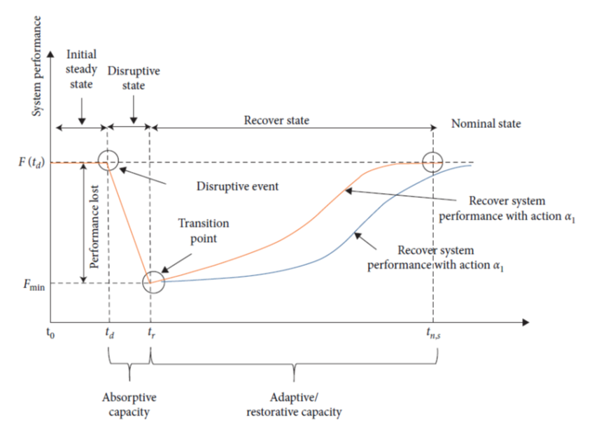

```{r setup, include=FALSE}
knitr::opts_chunk$set(echo = TRUE)
```

# Abstract

<!-- motivation -------------------------------------------------------- -->

<!-- short background ------------------------------------------------- -->

<!-- approach chosen / research method -------------------------------- -->

<!-- experimental work ------------------------------------------------ -->

<!-- results obtained ------------------------------------------------- -->

<!-- conclusions ------------------------------------------------------ -->

Resilience is important.

# Introduction

<!--  Nature of the problem. -------------------------------------------- -->

<!--  Background of previous work. -------------------------------------- -->

<!--  Purpose and significance of the paper. ---------------------------- -->

<!--  Method by which the problem is approached. ------------------------ -->

# Background

(ref:resiliencecurve) Conceptual depiction of time dependent system behaviour (c.f. @guo_resilience_2021)

```{r resiliencecurve, fig.cap="(ref:resiliencecurve)"}

```

Several researchers have described the generic concept of disruption and recovery with respect to service provision, transportation infrastructures from a performance-based perspective, e.g. @vugrin_recoverysequencing_2014, GLUCH, @koelle_resilience_2015. 
These approaches identify distinct phases. 
Fig. \@ref(fig:resiliencecurve) depicts these phases.

<!-- literal ======= change ----------->
proposed the generic concept of
disruption and recovery underlying performance-based
approaches, which is a time-dependent function F(t). Under
noral operating conditions, the system performance
measure F has a nominal value, until the system suffering a
disruption at the time t0, as illustrated in Figure 1.
(e resilience formulation is the ratio of recovery to loss:

$$R(t) = \frac{F(t) - F_{min}}{F_0 - F_{min}}$$

## heading 2

some cool text etc

* bullet 
* more bullets
* one more bullet

### heading 3

cool text and cool reference .

possibly some code chunks

```{r}
# this could be code
```


# Conclusions

<!--  What is shown by this work and its significance. ------------------ -->

<!-- Limitations and advantages. ---------------------------------------- -->

<!-- Applications of the results. --------------------------------------- -->

<!--  Recommendations for further work. --------------------------------- -->


<!-- -------------------------------------------------------------------- -->
<!-- MOVE THIS AFER THE REFERENCES IN THE FINAL VERSION! ---------------- -->
<!-- -------------------------------------------------------------------- -->
# Acknowledgements
If an acknowledgement is necessary, include it under the heading Acknowledgements using the Heading 1 style. Use the Body Text style and include the acknowledgements immediately after the references.
# Disclaimer
If a disclaimer is necessary, include it under the heading Disclaimer using the Heading 1 style. Use the Body Text/Normal Text style and include the disclaimer immediately after the acknowledgements.
# Email Addresses

# Conference Identification

2022 Integrated Communications Navigation and Surveillance (ICNS) Conference
April 5-7, 2022 


# References

